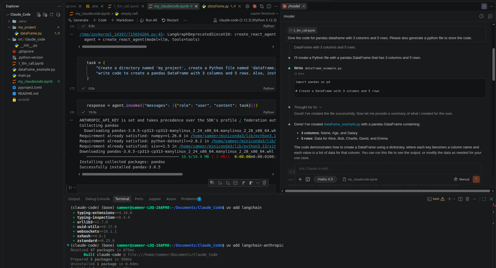
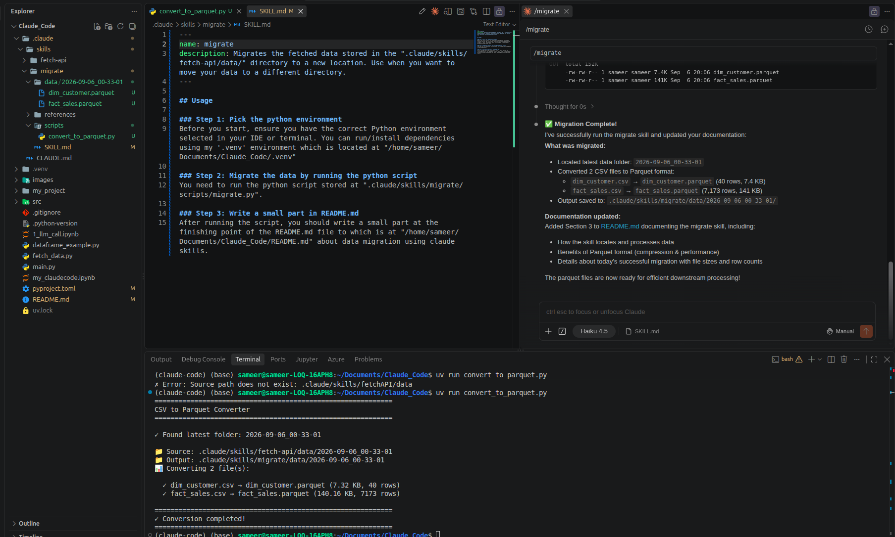

# Claude Code - Learning & Exploration

## Introduction

Claude Code is a powerful tool for integrating Claude AI with Python applications using the LangChain framework. Through exploration and hands-on practice, I've learned how to:

- **Initialize Claude LLM**: Set up ChatAnthropic with API key management using environment variables
- **Build Custom Tools**: Create reusable tools with the `@tool` decorator for file operations and package management
- **Work with Jupyter Notebooks**: Use interactive notebooks to test Claude integrations and build AI-powered workflows
- **Data Processing**: Generate and manipulate pandas DataFrames for data-driven applications
- **Agent-based Programming**: Understand how to bind tools to Claude models and enable agentic workflows

This repository documents my learning journey with Claude Code through practical examples and implementations.

## Setting Up with uv

**Note:** This project uses `uv` for Python dependency management — it's significantly faster than conda.

To get started:
- **Install dependencies:** `uv sync`
- **Add a new library:** `uv add package_name`
- **Run scripts:** `uv run python script.py`
- **Activate the environment:** `source .venv/bin/activate` (or use `uv run` to automatically use the virtual environment)

For more details, visit the [uv documentation](https://docs.astral.sh/uv/).

### Key Files

- `1_llm_call.ipynb` - Basic LLM interaction with ChatAnthropic
- `my_claudecode.ipynb` - Tool definitions for directory, file, and package operations
- `dataframe_example.py` - Pandas DataFrame creation example

*Figure: Claude Code environment with LLM integrations and tool execution*

---

### 1. Agent-Driven Project Automation
Created `my_claudecode.ipynb` to demonstrate practical agent automation. Built a ReAct agent using LangGraph that binds three custom tools:
- **create_directory**: Creates directories programmatically
- **create_file**: Writes Python code to files
- **install_package**: Installs Python packages via pip

Following the project standards defined in `CLAUDE.md`, the agent orchestrated these tools to create `my_project/dataframe.py` — a well-structured pandas DataFrame generator with 3 columns and 5 rows, automatically installing dependencies as needed. The generated code adheres to PEP 8 standards, uses clear variable naming (`snake_case`), and includes type hints and docstrings as specified in the project's coding guidelines.

### 2. API Data Fetching & Logging
Implemented the **fetch-api skill** to handle external data integration:
- Fetches CSV data from remote GitHub repositories using async httpx
- Automatically creates timestamped directories (`YYYY-MM-DD_HH-MM-SS` format) in `.claude/skills/fetch-api/data/`
- Stores fetched data as CSV files for downstream processing
- Generates detailed logs in `.claude/skills/fetch-api/logs/` tracking API calls, success/failure status, and error details

### 3. Data Migration Using Claude Skills
Implemented the **migrate skill** to convert and manage data formats:
- Automatically locates the latest timestamped folder in `.claude/skills/fetch-api/data/`
- Converts CSV files to Parquet format using pandas and PyArrow for improved compression and query performance
- Creates organized output in `.claude/skills/migrate/data/` maintaining the same folder structure
- Successfully migrated 2 data files on 2026-09-06:
  - `dim_customer.csv` → `dim_customer.parquet` (40 rows, 7.32 KB)
  - `fact_sales.csv` → `fact_sales.parquet` (7173 rows, 140.16 KB)
- Provides detailed logging with file sizes and row counts for each conversion

*Figure: Extension of Claude Code with skills (data migration)*
---